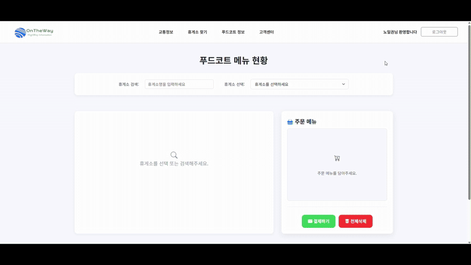

  

 

## 🛣️ 프로젝트 개요 (Project Overview)

**On The Way**는 전국 고속도로 휴게소 정보를 통합하여 제공하는 웹 애플리케이션입니다.  
한국도로공사 및 공공데이터 포털 API를 기반으로 휴게소의 위치, 편의시설, 푸드코트, 이벤트, 리뷰 등 다양한 정보를 시각적이고 직관적으로 제공하며, 사용자 편의를 최우선으로 설계되었습니다.

> 🚀 **주요 기능**: 휴게소 검색 · 상세정보 · 푸드코트 · 이벤트 · 공지사항 · 사용자 후기 및 평점 시스템  
> 🛠️ **개발 환경**: Java, JSP, JSTL, MySQL, jQuery, HTML/CSS, PortOne API  
> 👥 **팀 구성**: 김민규, 노일권, 박현규, 박호준, 조태민  
> 📅 **진행 기간**: 2025년 쌍용교육센터터 세미 프로젝트

---

## 🧩 주요 기능 (Main Features)

### 🔐 회원 관리
- 회원가입 / 로그인 / 로그아웃
- 회원 정보 수정 / 탈퇴
- 관리자 기능 분리 (공지사항/이벤트 관리 등)

### 🧭 휴게소 검색 & 필터
- 휴게소 이름 검색
- LPG 충전소 / 전기차 충전소 / 약국 필터 기능
- 검색 결과를 리스트 및 링크로 제공

### 🏪 휴게소 상세 정보
- 공공 API를 기반으로 한 휴게소 상세 페이지
- 위치, 주소, 노선, 편의시설, 브랜드 매장 정보 표시
- 공지사항 및 이벤트 정보 포함

### 🍜 푸드코트 메뉴 조회 & 주문
- 각 휴게소별 푸드코트 메뉴 조회
- 장바구니 기능 및 온라인 주문 기능 구현
- PortOne API를 통한 결제 처리

### 🌟 리뷰 및 평점 시스템
- 휴게소별 별점 등록 및 후기 작성
- 별점 평균 자동 계산, 정렬 기능 (추천순/최신순 등)
- 후기 추천/비추천 기능 (1회 제한)
- 후기 중복 등록 방지, 삭제 기능 (본인/관리자 권한)

---

## 🛠️ 사용 기술 (Tech Stack)

### Frontend
  
  
  

### Backend
  
  

### Database

### API / 기타
  
  

---

## 📸 프로젝트 시연 (Demo)

🔐 로그인 / 회원가입

  

⛽ 휴게소 정보

🎉 이벤트 정보

🚗 실시간 교통 정보

🍱 휴게소별 푸드코트
 

---

## 👥 팀원 역할 분담

| 이름 | 담당 |
|------|------|
| 김민규 | 회원가입 / 로그인 / 탈퇴 기능 |
| 박호준 | 공지사항 및 휴게소 검색 기능 |
| 박현규 | 휴게소 상세 페이지 구현 |
| 노일권 | 이벤트 및 푸드코트 메뉴 조회, 결제 연동 |
| 조태민 | 메인페이지, 리뷰 / 평점 / 추천 시스템 |

---

## 🧱 DB 설계 핵심 요약

- 리뷰(REVIEW) 테이블은 사용자 ID와 휴게소명 외래키 기반
- 평점 평균을 위한 `avg_star` 컬럼 추가
- GOOD 테이블로 추천/비추천 중복 방지
- 주문 내역과 후기 등록 시 각각 고유 식별자 및 연동 로직 구성

---

## 📚 참고 자료

- [한국도로공사 고속도로 휴게소 API](https://data.ex.co.kr/)
- [공공데이터포털](https://www.data.go.kr/)
- [PortOne 결제 API](https://portone.io/)

